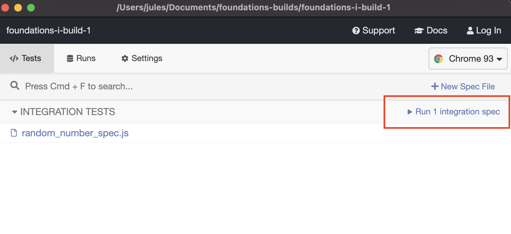

# Coin Flip
## What *HTML Elements* do I need?
* text field for displaying the result
* button to submit
* text field for displaying the result
* text field for wins and losses

## What *state* do I need?
* userChoice
* wins / losses 
* randomCoinFlip

## What *events* am I listening for?
* buttonClick
    * generate a random coin flip
    * get the users input
    * compare random flip to user choice
        * if they guessed correctly -- increment wins
        * else increment the losses
    * display the results

## Making a plan

## To Run Cypress Tests
* `npm install`
* `npm test`
* Cypress will open -- you should then click "run <#> integration spec(s)"
    
* Make sure all tests pass